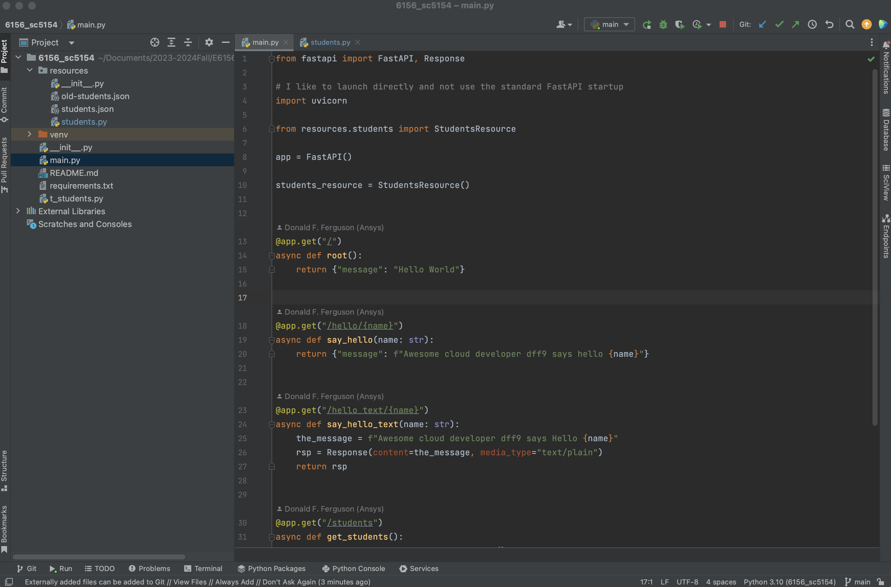
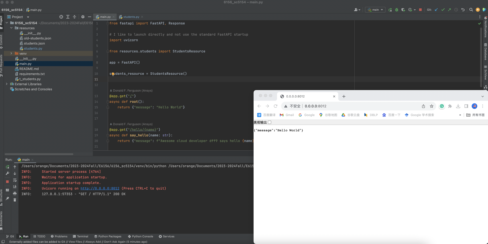
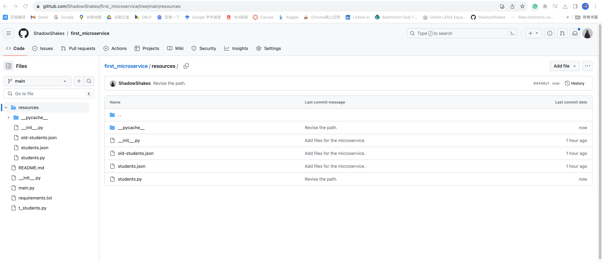
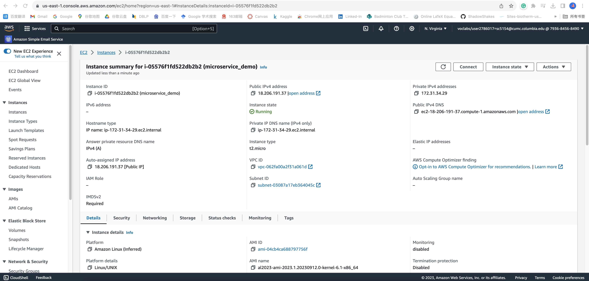
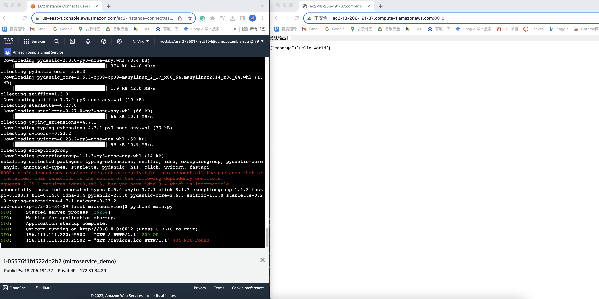

# COMSE6156 - Topics in SW Engineering: Cloud Computing Sprint 0 Status Report of Shaohan Chen - sc5154

## Overview

Sprint in a concept from [Agile SW development](https://en.wikipedia.org/wiki/Agile_software_development).
Project teams will follow a simplified version of agile development to build their projects. A core concept in
agile development is _a sprint._

|         |
|:------------------------------:|
| __Agile Development: Sprints__ | 

Sprint-0 is an individual sprint that focus on setting up their environments. I have completed the sprint
individually. This document is the file for submitting a status report on Sprint-0. 
Completing the report includes taking screenshots and including them
in the relevant sections of the Markdown document.

## Clone and Modify the Starter Project

The project has been cloned to the local. The path has been modified to my local path. An overview of the starter project in PyCharm is shown below:

|  |
|:---------------------------------:|
|        __Cloned Project__         | 

## Execute the Starter Project

The project is executing, the following picture shows  the execution window and browser side-by-side.

|  |
|:---------------------------------:|
|       __Project Execution__       | 

## Create Your Own GitHub Project

I made a copy of the project and create a project in my own GitHub repository, which is shown below:

|  |
|:----------------------:|
| __Project on GitHub__  | 

## Deploy and Test Project on AWS

Here is information about my VM through the console.

|  |
|:---------------------------:|
|       __AWS Console__       | 

The picture shows that the application is running in the EC2 terminal and browser.

|  |
|:---------------------------:|
|     __Service Running__     | 

Thanks for your time!

Shaohan Chen sc5154
